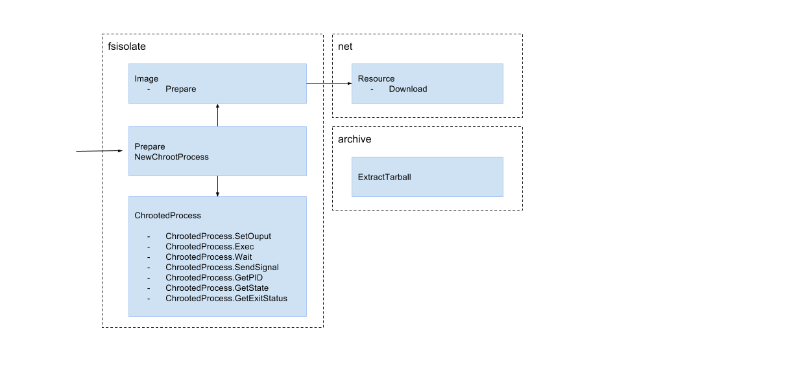

# fsisolate

Worst name ever for a library that encapsulates chroot.


# Tests
- [x] Write tests!
- [x] URL Linux
- [x] Dir Linux
- [x] File Linux
- [x] URL Darwin
- [x] Dir Darwin
- [x] File Darwin
- [x] Non existing URL
- [x] Non tar resource URL
- [ ] File tar zipped (not supported)
- [x] Non existing Dir

# Improvements

- [ ] Errors might not bring context information
- [ ] Document every package
- [ ] Check if directories exits (root and image) before creating and extracting tar
- [ ] Show download progress
- [ ] Support download redirections
- [ ] Development setup instructions and dependency management

# Design



# Usage

```

// prepare image t
isolation, err := fsioscli.PrepareIsolation(image, root)
...

// execute process
err = isolated.Exec(process, args)
...

err = chrootProc.Wait()
...

```

# Tests
